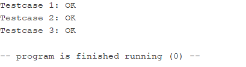

# ДЗ6

**Внимание:** эмулятор *RARS* работает с файлами кодировки *cp1251*, которая некорректно отображается в браузере. Скриптом *convert_encoding.py* файлы были перекодированы в *utf-8*, результат лежит в папке *utf8*.

## Запуск

Для того, чтобы использовать функцию `strcpy`, файл *string.asm* необходимо добавить в целевую сборку. Чтобы использовать макрос запуска, нужно включить его в файл программы.

## Код

Реализация функции `strcpy` лежит в *string.asm*, макрос для её вызова - в *string.inc*. В *test.asm* лежит тестовая программа.

## Результат запуска тестовой программы

 
